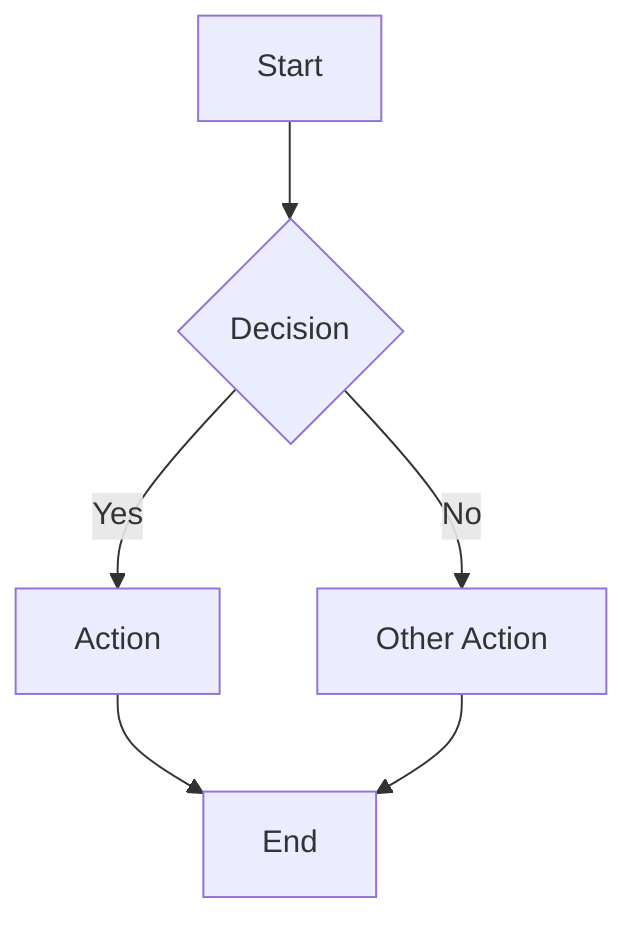
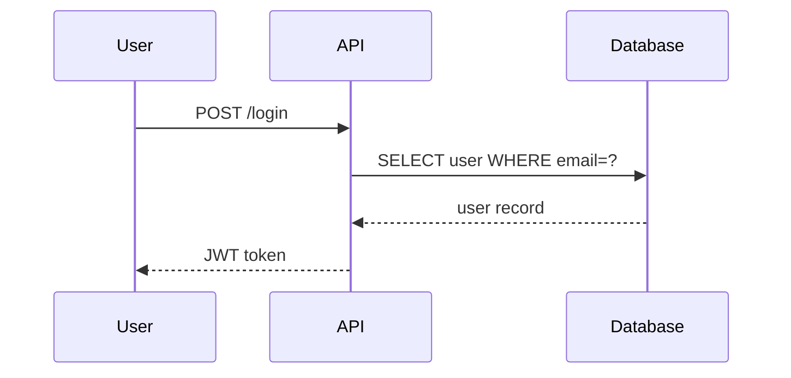
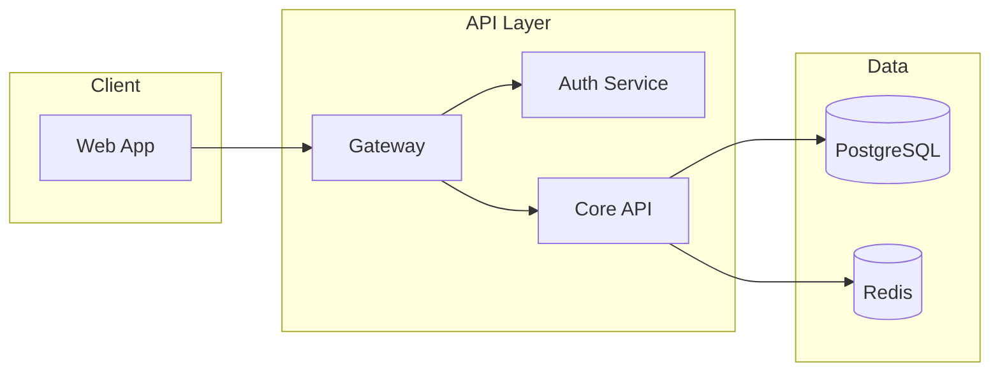
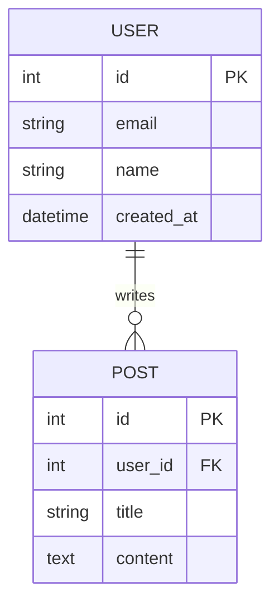
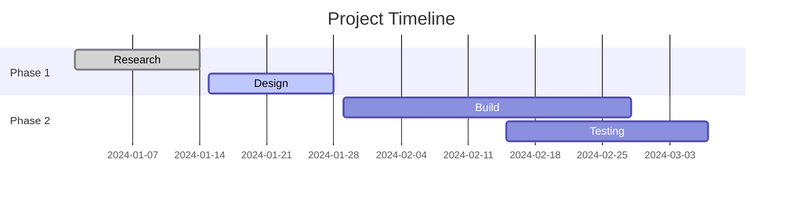
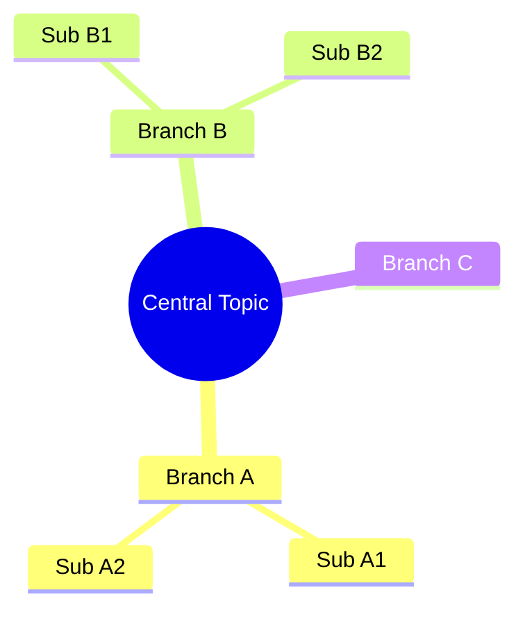
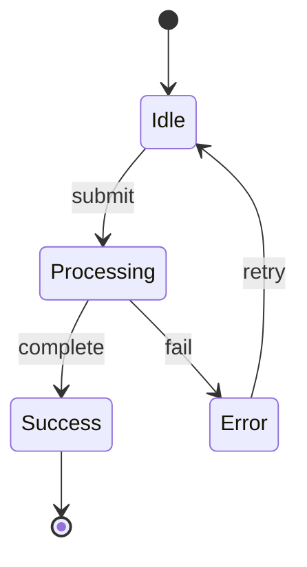

# Media Skill

Create visual and structured content.

---

## Workflow Routing

| Trigger | Workflow |
|---------|----------|
| "flowchart", "flow diagram" | Mermaid Flowchart |
| "sequence", "message flow", "API flow" | Mermaid Sequence |
| "architecture", "system design", "components" | Architecture Diagram |
| "ER diagram", "database", "entity relationship" | Mermaid ER |
| "timeline", "gantt", "schedule" | Mermaid Gantt |
| "mindmap", "brainstorm visual" | Mermaid Mindmap |
| "ASCII art", "terminal diagram" | ASCII Diagram |
| "image prompt", "generate image", "DALL-E", "Midjourney" | Image Prompt |
| "state machine", "state diagram" | Mermaid State |

---

## MERMAID FLOWCHART
*Process flows, decision trees, algorithms.*

**Invoke:** `media flowchart: [describe the process]`

Always wrap in a ```mermaid code block. Default direction: TD (top-down). Use LR for wide horizontal flows.



**Rules:**
- Node shapes: `[rectangle]` for steps, `{diamond}` for decisions, `((circle))` for start/end, `[/parallelogram/]` for I/O
- Labels on arrows: `-->|label|`
- Subgraphs for grouping: `subgraph Title ... end`

---

## MERMAID SEQUENCE DIAGRAM
*Message flows between actors — APIs, protocols, user interactions.*

**Invoke:** `media sequence: [describe the interaction]`



**Rules:**
- `->>`  solid arrow (request), `-->>`  dashed arrow (response)
- `activate`/`deactivate` for lifecycle bars
- `Note over A,B: text` for annotations
- `loop`, `alt`, `opt` for control flow blocks

---

## ARCHITECTURE DIAGRAM
*System components, their relationships, and boundaries.*

**Invoke:** `media architecture: [describe the system]`

**Procedure:**
1. @coder: "Produce a Mermaid architecture diagram for: [system]. Use subgraphs for bounded contexts or tiers. Show: components as nodes, relationships as labeled edges (direction matters), external systems distinguished from internal. Use flowchart LR or TD."
2. If Mermaid would be too complex (>20 nodes), fall back to structured ASCII.

**Mermaid example:**


**ASCII fallback:**
```
┌─────────────────────────────────────────┐
│  Client                                 │
│  ┌─────────┐                            │
│  │ Web App │                            │
│  └────┬────┘                            │
└───────┼─────────────────────────────────┘
        │
┌───────┼─────────────────────────────────┐
│  API  ▼                                 │
│  ┌─────────┐    ┌──────┐  ┌──────────┐  │
│  │ Gateway │───▶│ Auth │  │ Core API │  │
│  └─────────┘    └──────┘  └────┬─────┘  │
└──────────────────────────────┼──────────┘
                               ▼
                         ┌──────────┐
                         │ Database │
                         └──────────┘
```

---

## MERMAID ER DIAGRAM
*Database schema and entity relationships.*

**Invoke:** `media er: [describe the data model]`



---

## MERMAID GANTT
*Project timelines and schedules.*

**Invoke:** `media gantt: [describe the project timeline]`



---

## MERMAID MINDMAP
*Brainstorming, topic decomposition, knowledge mapping.*

**Invoke:** `media mindmap: [central topic]`



---

## MERMAID STATE DIAGRAM
*State machines, lifecycle diagrams, workflow states.*

**Invoke:** `media state: [describe the state machine]`



---

## ASCII DIAGRAM
*Terminal-friendly diagrams using box-drawing characters. Use when Mermaid is not available.*

**Box-drawing character reference:**
```
┌─┬─┐  Corners: ┌ ┐ └ ┘
│ │ │  Borders: │ ─
└─┴─┘  Junctions: ┬ ┴ ├ ┤ ┼
───▶   Arrows: → ← ↑ ↓ ▶ ◀ ▲ ▼
```

---

## IMAGE PROMPT
*Generate prompts for image generation models (DALL-E, Midjourney, Flux, Stable Diffusion).*

**Invoke:** `media image-prompt: [describe the image]` or "create image prompt for [X]"

**Procedure:**
1. Clarify the target model if specified (DALL-E 3, Midjourney v6, Flux, Stable Diffusion).
2. Build the prompt with:
   - **Subject**: Clear description of main subject
   - **Style**: Art style, medium (photography, illustration, oil painting, etc.)
   - **Lighting**: Natural, studio, golden hour, dramatic, etc.
   - **Composition**: Wide shot, close-up, bird's eye, etc.
   - **Quality modifiers**: photorealistic, 8K, detailed, etc.
   - **Negative prompt** (if supported): what to exclude

**DALL-E 3 format:**
```
[Subject description]. [Style]. [Lighting]. [Composition]. [Mood/atmosphere].
```

**Midjourney format:**
```
[subject], [style], [lighting], [composition] --ar 16:9 --v 6 --style raw
```

**Flux/SD format:**
```
Positive: [detailed description, style keywords, quality modifiers]
Negative: [blurry, low quality, watermark, distorted, nsfw]
```
